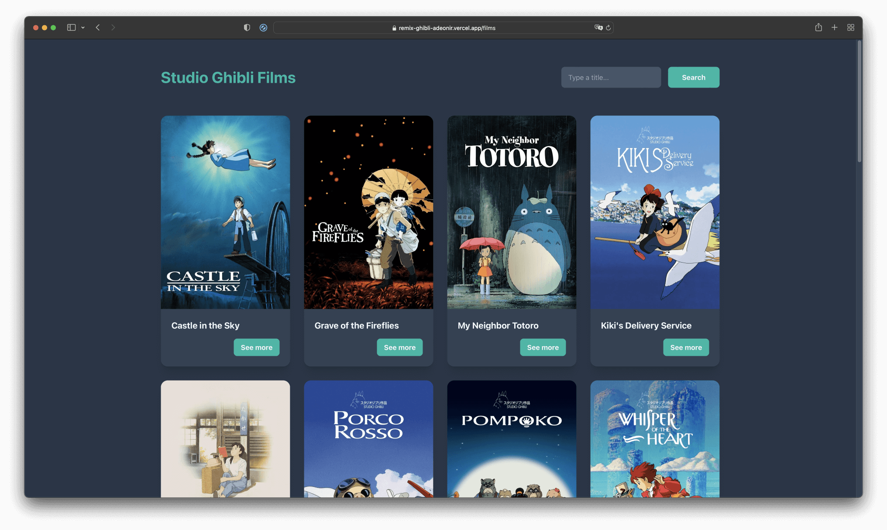
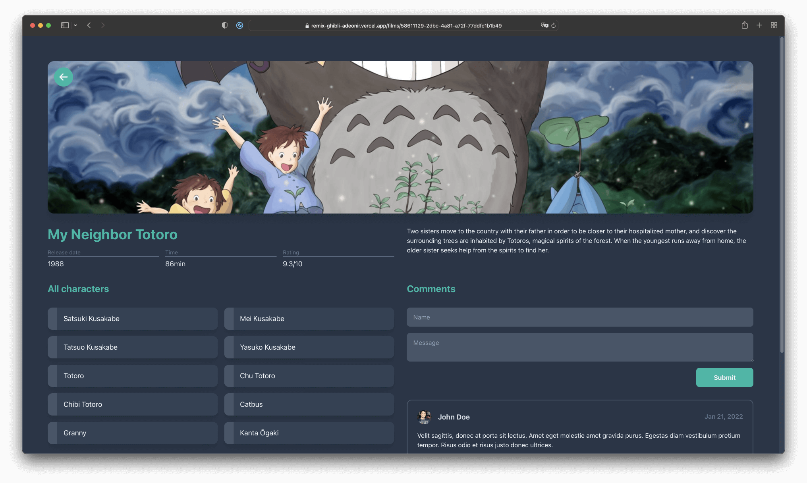

# Welcome to Studio Ghibli Films

A small project, based on this [Remix.run crash course](https://www.youtube.com/watch?v=HOlYQu_r4Io), using the [Ghibli API](https://ghibliapi.herokuapp.com).

I've also created a simple design in Figma for this project using Tailwind tokens, you can view it [here](https://www.figma.com/file/TJbiqMb4Ha3OEDskctRyVm/Studio-Ghibli/duplicate).

You can see the demo [here](https://remix-ghibli-adeonir.vercel.app).

## Preview

**Home page**

<p align="center">
  
</p>

**Film page**

<p align="center">
  
</p>

## How to use

1. Download this repo:

```bash
npx degit adeonir/remix-ghibli remix-ghibli
```

2. Install dependencies:

```sh
yarn install
```

2. Add `.env` file:

```sh
cp .env.example .env
```

3. Run the server:

```sh
yarn dev
```

This starts your app in development mode, running at `http://localhost:3000` and a json-server at `http://localhost:3001`.

The json-server is used to mock the comments API locally.

### What's inside

- [Remix](https://remix.run)
- [ReactJS](https://reactjs.org)
- [TypeScript](https://www.typescriptlang.org)
- [Tailwind CSS](https://tailwindcss.com)

---

Made with ♥️ by Adeonir Kohl
